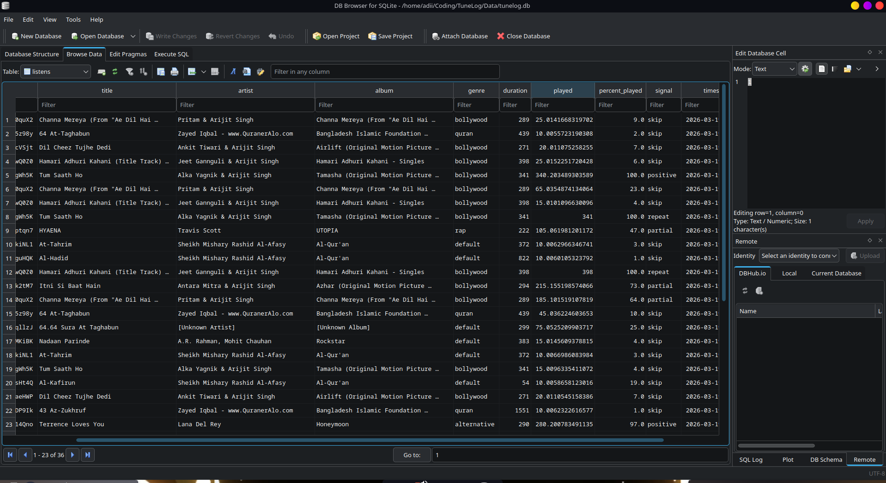
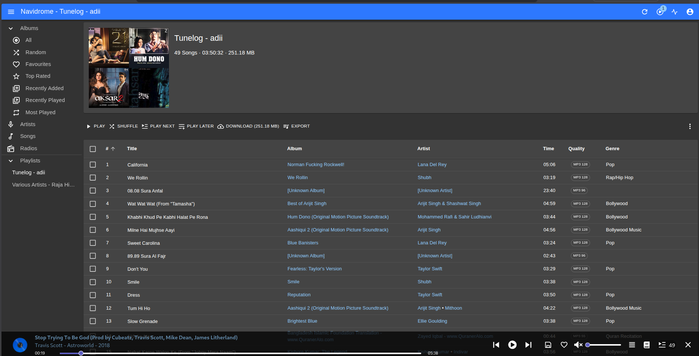

# TuneLog
A lightweight, self-hosted music recommendation system that learns your taste from how you actually listen — no ratings, no manual input.


# 🤖 AI Usage

This project was built by me, with AI assistance in specific areas:

- **SQL queries** — helped write and optimise some of the SQLite queries
- **Boilerplate code** — repetitive setup code like DB connection handlers and URL builders
- **Documentation** — README formatting and wording

The core logic — signal system, scoring formula, genre injection, playlist slot system, and architecture decisions — was designed and written by me.

## TODO: 
- Add a better api system for search excilit tag of songs,
   I have some ideas how to do it,
  currently in my songlist db in excilipt col there is notinitunes in some song, thats becuase some of the songs has noisy title ig : DJ Alok Main aur tu remix, these makes itunes to return wrong info
  My idea is to make api requests to itunes in trail and error, try dj alok, try alok main  , try mai or tu, and use fuzzy module to get the closest to the reposne and use that, this will take time so make it automatic at a specify time i.g, 1 Am 

## How It Works
TuneLog watches your Navidrome listening activity in the background. It tracks whether you skip, finish, or replay songs, and uses that behavior to build personalised playlists automatically — one per user.

| Listening Behavior | Signal | Weight |
|---|---|---|
| Skipped before 30% | skip | -2 |
| Played 30–80% | partial | +1 |
| Played to end | positive | +2 |
| Replayed after 10 min | repeat | +3 |

Scores are weighted by recency — a listen from yesterday counts more than one from 3 months ago.

Generated playlists include:
- **Scored songs** — ranked by signal weight × recency
- **Genre-injected unheard songs** — new songs from genres you already listen to
- **Wildcards** — songs you liked but haven't heard in 60+ days
- **Skip re-exposure** — occasional re-surfacing of skipped songs (tastes change)

## Stack
- **Navidrome** — self-hosted music server (Subsonic API)
- **Python** — watcher + playlist generator
- **SQLite** — two local databases (listen history + full library)
- **FastAPI** — REST API layer (early stage)
- **React + TypeScript + Vite** — web dashboard (early stage, TailAdmin base)

## Project Structure
```
TuneLog/
├── backend/
│   ├── main.py          # entry point — watcher loop + playlist trigger
│   ├── playlist.py      # scores songs, builds + pushes playlist to Navidrome
│   ├── library.py       # syncs full song library from Navidrome into SQLite
│   ├── db.py            # SQLite schema and connection helpers
│   ├── config.py        # builds Navidrome API URLs + per-user credentials
│   ├── api.py           # FastAPI backend — exposes SQLite data to dashboard
|   ├── Dockerfile
│   └── Data/
│       ├── tunelog.db   # listen history (auto-created)
│       └── songlist.db  # full library cache (auto-created)
├── frontend/            # web dashboard (TailAdmin + React + Vite)
│   ├── src/
│   └── ...
|   ├── Dockerfile
├── .env                 # your credentials (never commit this)
├── .env.example         # template — copy this to .env
├── compose.yaml         # docker compose for backend + frontend
└── Dockerfile
```

## Multi User

Users can be added directly from the TuneLog web dashboard — no manual config editing needed.

1. Open the web UI at **http://localhost:5173/**
2. Go to **Users** from the sidebar
3. Fill in the username and password — TuneLog will create the user in Navidrome and register them automatically

> If you're running via Docker, replace `localhost` with your server's IP address.


## Requirements
- Python 3.10+
- Navidrome instance (local or remote)
- Docker (optional, recommended for Navidrome)

## Setup

> ⚠️ **Note:** Docker and manual (`python main.py`) runs are mutually exclusive.
> Docker marks the `data/` folder as root-owned, so Python cannot write to it outside the container.
> Run one or the other — not both.


### Web UI (early stage — work in progress)

> ⚠️ The web dashboard is in early development. Data is connected but UI still needs significant polishing. Not production-ready.

**1. Start the API server**
```bash
cd backend
pip install fastapi uvicorn
uvicorn api:app --reload --port 8000
```

**2. Start the frontend**
```bash
cd frontend
npm install
npm run dev
```

Dashboard will be available at `http://localhost:5173`. Requires the API server running on port 8000.

---

### Docker (recommended for backend)

**1. Clone the repo**

**2. Configure your environment**
```bash
cp .env.example .env
# Edit .env with your Navidrome URL, credentials, etc.
```
**3. Run**
```bash
docker compose up --build
```

### Manual
**1. Clone the repo**

**2. Configure your environment**
```bash
cp .env.example .env
# Edit .env with your Navidrome URL, credentials, etc.
```
**3. Install dependencies**
```bash
cd backend
pip install -r requirements.txt
```
**4. Configure `.env`**
```env
BASE_URL=http://your-navidrome-ip:4533
ADMIN_USERNAME=your_admin_username
ADMIN_PASSWORD=your_admin_password

# Per-user credentials
USER_username1=username1
PASSWORD_username1=yourpassword

USER_username2=username2
PASSWORD_username2=yourpassword

# API
VITE_API_URL=http://localhost:8000
# VITE_API_URL=http://backend:8000  ← use this when running via Docker
```

For multiple users add the following in `config.py`:
```python
USER_CREDENTIALS = {
    os.getenv("admin_username"): os.getenv("admin_password"),
    os.getenv("USER_youruser"): os.getenv("PASSWORD_youruser"),
    ## Manually add as many users as you have
}
```

**5. Change playlist size**
```python
# playlist.py
PLAYLIST_SIZE = 10
```

**6. Run**
```bash
python main.py
```

> **Note:** If you are using a Navidrome client, turn on the scrobbling feature or it will not report back.

TuneLog will:
- Start watching what's playing in real time via SSE
- Log listen history to SQLite
- Automatically regenerate personalised playlists every hour (when no one is playing)

## Playlist Generation
Playlists are pushed directly to Navidrome and appear under each user's account as **"Tunelog - username"**. They are private — only visible to the playlist owner.

| Slot | Share | Notes |
|---|---|---|
| Unheard (genre-filtered) | up to 35% | shrinks as library gets explored |
| Positive | ~20% | songs you finished |
| Repeat | ~20% | songs you came back to |
| Partial | ~12% | songs worth another chance |
| Wildcard | ~8% | good songs not heard in 60+ days |
| Skip | ~5% | rare re-exposure |

## Database


## Playlist


## Roadmap
- [x] Navidrome API connection
- [x] SQLite listen logger
- [x] Multi-user support
- [x] INSERT on new song, UPDATE within 10 min window
- [x] Signal scoring (skip / partial / positive / repeat)
- [x] Recency-weighted scoring
- [x] Genre-injected unheard song discovery
- [x] Wildcard resurrection (60-day decay)
- [x] Per-user personalised playlists
- [x] Playlist pushed directly to Navidrome (private, per-user)
- [x] Docker support
- [x] FastAPI backend (early stage)
- [ ] Web UI dashboard (in progress — needs polish)
- [ ] Auto library sync scheduler
- [ ] M3U export

## Why TuneLog?
Most self-hosted music servers either have no recommendations or rely on external APIs like Last.fm. TuneLog is fully offline, stores everything locally, and is built around implicit feedback — your listening behaviour is the only input needed.

---
> Built for Navidrome. Inspired by how early Last.fm and Spotify worked before they had millions of users.

## Credits
- UI built on [TailAdmin React](https://github.com/TailAdmin/free-react-tailwind-admin-dashboard) (MIT)
